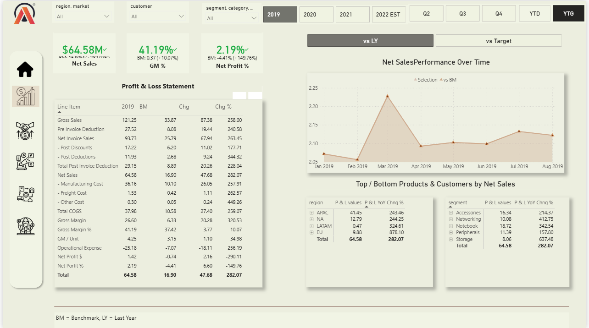
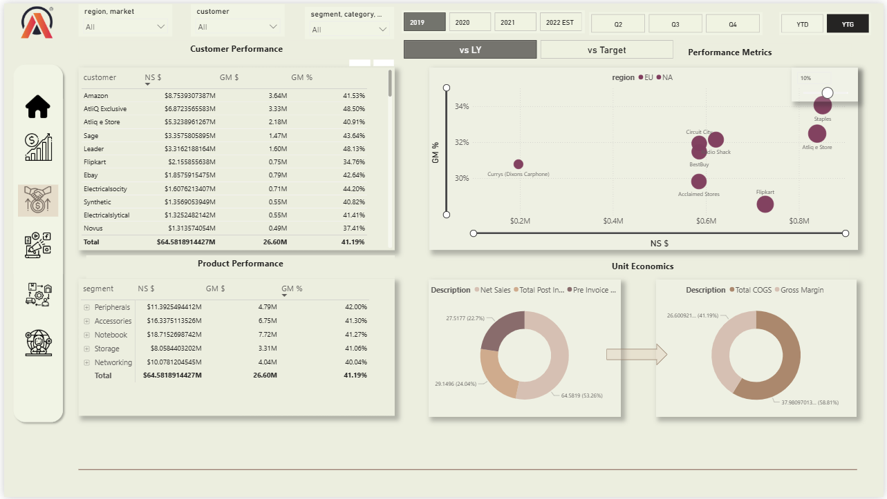
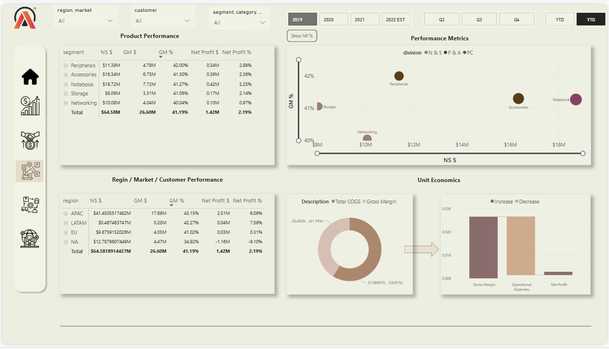

# 🚀 Business Insights 360 – AtliQ Hardwares Edition (Power BI)

**Business Insights 360** is an end-to-end Power BI solution built to replace slow, Excel-based reporting with a **single, interactive dashboard** that connects **Finance, Sales, Marketing, Supply Chain, and Executive leadership** into one consistent story.

AtliQ Hardwares was scaling fast, and decision-making needed to be faster than spreadsheets. This dashboard is designed to give leaders **answers at a glance**—with drilldowns, dynamic KPIs, and business-ready views across functions. 

## 📌 Project Overview
The EV industry isn’t the only space moving fast—hardware distribution is a high-velocity business where late insights = lost money.

This project consolidates key business dimensions into one Power BI report:
- **Executive View** (top-level insights across the business)
- **Finance View** (P&L, profitability, trends)
- **Sales View** (customer performance + growth vs profitability)
- **Marketing View** (product performance + growth vs profitability)
- **Supply Chain View** (forecast accuracy, net error, risk indicators)

The report includes navigation-style pages and a “home/info” layout similar to a business tool interface.

## 🎯 Problem Statement
AtliQ Hardwares needed to transition from Excel-heavy reporting to a scalable BI system that could:
- reduce reporting time,
- provide consistent KPIs across teams,
- enable fast drilldowns by customer/product/region,
- track profitability, growth, and supply risks,
- support decision-making across leadership and operations.

## 🧩 Dashboard Views (What’s Inside)

### 1) 🏢 Executive View
A top-level dashboard consolidating insights from all business dimensions to support leadership decision-making. 

### 2) 💰 Finance View (P&L + Performance Over Time)
Designed for financial analysis with filters for **customer / product / country / region** and flexible time selections.

Includes:
- Profit & Loss statement
- Net Sales performance over time
- GM% and Net Profit% tracking
- Top/Bottom products & customers by Net Sales  
Example KPIs shown in the report:
- **Net Sales:** 3,736.17M  
- **GM%:** 38.08%  
- **Net Profit%:** -13.98% :contentReference[oaicite:4]{index=4}

### 3) 📈 Sales View (Customer Performance + Profitability/Growth Lens)
Focuses on customer performance using core metrics like **Net Sales, Gross Margin**, and a **profitability vs growth matrix**.

Includes:
- Customer performance table (NS$, GM$, GM%)
- Growth vs profitability positioning (matrix style)
- Unit economics breakdown visuals :contentReference[oaicite:5]{index=5}

📌 Add screenshot:

### 4) 📣 Marketing View (Product Performance + Profitability/Growth Lens)
Analyzes product performance across segments/categories with a similar profitability/growth analysis lens.

Includes:
- Product performance table (NS$, GM$, GM%, Net Profit%)
- Segment and region performance breakdowns
- Performance metric visuals for decision-ready insights 

📌 Add screenshot:

### 5) 🚚 Supply Chain View (Forecast Accuracy + Risk Signals)
Built to track operational accuracy and identify risk areas across customers/products/segments.

Key metrics shown:
- **Forecast Accuracy %**
- **Net Error**
- **ABS Error**
- Risk classification indicators (e.g., OOS / EI) 

📌 Add screenshot:

## 📊 Key Metrics Included (Examples from Report)
- Net Sales, GM%, Net Profit%
- Customer/Product/Segment performance tables
- Forecast Accuracy, Net Error, ABS Error
- Market share and channel/division revenue breakdowns (as shown in Executive insights layout) 

## 🔧 Workflow (What I Did)
1. Collected and prepared datasets (multiple business domains)
2. Cleaned and transformed data using **Power Query**
   - standardized columns, types, and structures
   - automated repeatable steps for refresh-ready pipelines
3. Built a robust data model
   - relationships across finance, sales, product, and supply chain entities
4. Developed optimized DAX measures
   - dynamic KPIs, YoY comparisons, growth metrics, profitability measures
5. Designed a multi-view dashboard experience
   - navigation buttons, slicers, drill-through, and consistent UX patterns
6. Performance tuning
   - improved model efficiency and refresh performance
7. Published and deployment readiness (Power BI Service style workflow)
   - structured for scheduled refresh + secure sharing (concept reflected in tool-style design)

## 🧠 Skills & Tools Used
- **Power BI** (dashboarding, modeling, publishing-ready design)
- **DAX** (measures, KPIs, time intelligence, growth metrics)
- **Power Query** (data prep, cleaning, automation)
- **SQL + Excel** (supporting extraction/validation and source prep)

## 💡 Business Value
This dashboard helps:
- **Executives** track overall company health with one unified view
- **Finance teams** monitor profitability and performance trends
- **Sales teams** identify customer growth vs profitability trade-offs
- **Marketing teams** evaluate product contribution and positioning
- **Supply chain teams** track forecast accuracy and reduce stock risk

